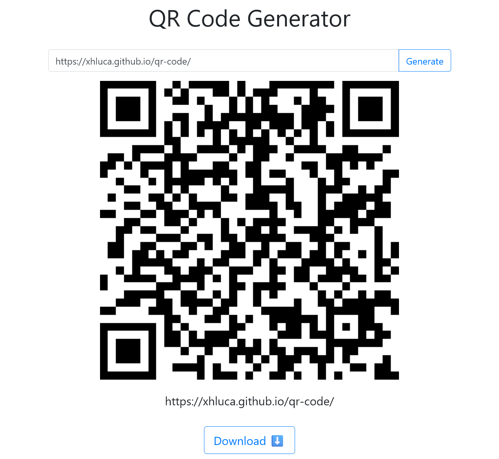

# QR Code Generator

A simple QR code generator that allows you to generate QR codes for any text you input.

## About

* Simple: No fancy feature like colors, shapes, logo insertion, etc. Just a plain and simple QR code.
* Unbloated: No unnecessary features, no unnecessary code. Doesn't take 20 seconds to load.
* Fast: No need to install any software or app. Just open the website and generate the QR code.
* Free: No need to pay for anything. It's free and open source, licensed under the MIT License.
* No ad: I'm not here to make money off you.
* No tracking or cookies: I don't track you because I don't care who you are or what you do with the QR code.
* No account or subscription: No need to sign up or log in. No need to pay for a subscription. Just use it and forget about it.
* Offline and downloadable: If you use Chrome, you can download this webpage as an app and use it offline because it is a progressive web app (PWA).
* Open source: You can see the source code and modify it as you like. You can even download the source code (`index.html`) and run it yourself. Again, no internet needed.

Not convinced? Could be better? IDC, just fork it and add your own features. Or just use it as it is. Again, it's free and open source.

## Acknowledgement

Built using [qrcode.js](https://davidshimjs.github.io/qrcodejs/) and [Bootstrap](https://getbootstrap.com/).
